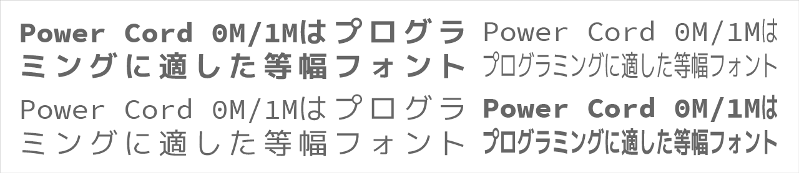

# Power Cord 0M/1M



Power Cord 0M/1Mは、[Source Code Pro](https://github.com/adobe-fonts/source-code-pro)、[Migu 1M](http://mix-mplus-ipa.osdn.jp/migu/)、および[vim-powerline](https://github.com/Lokaltog/vim-powerline)と[vim-airline](https://github.com/vim-airline/vim-airline)で使用されているいくつかのシンボルを合成したプログラミングに適した等幅フォントです。

## 特徴

- 1Mはすべての全角文字と半角文字の幅が2:1になるように調整されています
- 0Mは本来の全角文字も含めたすべての文字が同じ幅に調整されています
- [vim-powerline](https://github.com/Lokaltog/vim-powerline/tree/develop/fontpatcher)が適用されています
- Powerlineのパッチでは補完しきれてない一部シンボルを追加しています

## レシピ

このフォントの元となったSouce Code ProとMigu 1Mのそれぞれのライセンスは、フォント改変や再頒布などが許諾されているオープンなものですが、2つの異なるライセンスですので合成した場には競合する恐れがあります。よって合成のための「レシピ」として配布しています。

別途 Source Code Pro および Migu 1M フォントをダウンロードいただき、`make`コマンドを実行するだけであとは自動で合成されます。

- Source Code Pro は以下の2通りの方法があります
  - GitHubの[リポジトリ](https://github.com/adobe-fonts/source-code-pro)をクローンして自分でビルドする方法が最も安全ですが、ビルドには[AFDKO](http://www.adobe.com/devnet/opentype/afdko.html)のインストールが必要です
  - その他の再頒布元からダウンロードする方法が最も簡単ではありますが以下のサイトの安全性については保障はできません
    - http://www.fontsc.com/font/source-code-pro
    - http://www.1001fonts.com/source-code-pro-font.html 
- Migu 1M は以下のサイトで配布されています
  - http://mix-mplus-ipa.osdn.jp/migu/
- レシピの実行には`make` `fontforge` `git` の3つのコマンドが必要です。Linux環境が最も簡単でお勧めです。Windowsで実行したい場合はBash on Ubuntu on WindowsやMSYS2などをご用意いただければ可能ですが若干難易度が高いと思われます。（Bash on Ubuntu on Windowsでの動作確認は行っています）
- `Makefile`と同じフォルダ上にsrcを作成し、ダウンロードしたフォントを以下のように配置してください。あとは`make`コマンドを実行すると。自動的に生成されます。

```
+-- Makefile
|-- merge.py
|-- ...
+-- src
    |-- SourceCodePro-Regular.ttf
    |-- SourceCodePro-Bold.ttf
    |-- migu-1m-regular.ttf
    +-- migu-1m-bold.ttf
```

## 合成に使用されるフォントの著作権

合成に使用されるフォントはこのリポジトリには含まれてはおりませんが著作権に関しては以下の通りです。

- **Souce Code Pro 1M** Copyright 2010, 2012 [Adobe Systems Incorporated](http://www.adobe.com/), with Reserved Font Name 'Source'. All Rights Reserved.
  - Source is a trademark of Adobe Systems Incorporated in the United States and/or other countries.  
  - [SIL Open Font License, Version 1.1](https://opensource.org/licenses/OFL-1.1)
- **Migu 1M** はItou Hiroki氏による以下の2つの合成フォントです
  - **M+フォント** Copyright (C) 2002-2015 M+ FONTS PROJECT
    - これらのフォントはフリー（自由な）ソフトウエアです。あらゆる改変の有無に関
      わらず、また商業的な利用であっても、自由にご利用、複製、再配布することがで
      きますが、全て無保証とさせていただきます。(http://mplus-fonts.osdn.jp/about.html#license) 
  - **IPAゴシック** Copyright(c) Information-technology Promotion Agency, Japan (IPA), 2003-2011.
    - [IPA Font License](https://opensource.org/licenses/IPA) 
- **Powerline Patcher** Copyright 2013 Kim Silkebækken

なお、一部のシンボルはこのレシピのコードがオリジナルで一部生成＆補完します。現在のバージョンでは以下のシンボルを補完します。今後時間があれば追加していきたいです。

- U+2630 ～ U+2637
- U+2734 ～ U+2739

## このレシピの著作権およびライセンス

このレシピ（MakefileやPythonスクリプトなど）はすべて[MITライセンス](https://opensource.org/licenses/MIT)として配布しますので、商用・非商用問わず無償で自由に書き換えて他の合成フォントのスクリプトに転用しても構いません。ただし以下の著作権表示・ライセンス表示をソフトウェアのすべての複製または重要な部分に記載してください。

```
Copyright (C) 2016 Retorillo
Distributed under the MIT license
https://opensource.org/licenses/MIT
```
